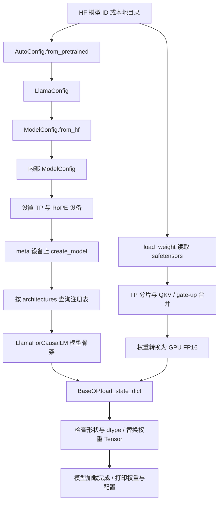
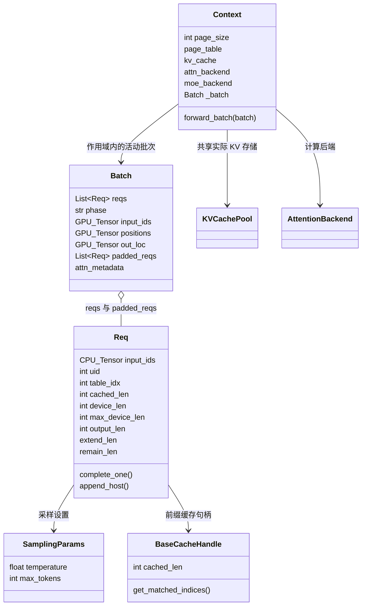

# Mini-SGLang 动手任务与打卡

本目录覆盖 3.1、4.1、4.2、4.3、4.4（选择三）。

## 3.1 最小脚本

[minimal_llama.py](minimal_llama.py) 使用公开的 TinyLlama/TinyLlama-1.1B-Chat-v1.0，它的架构为 LlamaForCausalLM。脚本实际读取预训练 safetensors 权重，并加载到 Mini-SGLang 的 Llama 实现；不是只加载配置或随机初始化模型。

```bash
cd /home/horizon/Code/ai_infra/mini-sglang
source activate-minisgl.sh
set -o pipefail
python -u exercises/llama-checkin/minimal_llama.py \
  2>&1 | tee exercises/llama-checkin/run.log
```

本次 Hub 下载发生停滞，改从官方文件 URL 下载到上述本地目录，固定提交为 `fe8a4ea1ffedaf415f4da2f062534de366a451e6`。来源记录见模型目录的 `source.json`。脚本不指定 --model 时优先使用项目内的模型目录；如果本地模型不存在，才使用公开模型 ID。

也可传入 `--model /绝对路径/本地Llama模型`，目录需包含 HF 配置、tokenizer 和 safetensors 权重。每次在新 Python 进程运行，避免重复设置 TP/Context 全局状态。

## 4.1 基类、配置与数据结构说明

- **基类**：`LlamaForCausalLM` 继承 `BaseLLMModel`；后者定义抽象的 `forward() -> Tensor` 接口，并通过 `BaseOP` 提供权重管理。脚本以 `BaseLLMModel` 做 isinstance 检查。Mini-SGLang 模型不是 torch.nn.Module，使用自己的 `load_state_dict`。
- **配置**：`AutoConfig.from_pretrained` 读取 HF LlamaConfig，`ModelConfig.from_hf` 转换为内部字段，然后 `create_model(config)` 根据 architectures 实例化模型。打印内容包含层数、Q/KV 头数、head_dim、隐藏维度、词表和 RoPE 配置。
- **加载**：先设置 TP rank=0/size=1 与 RoPE 设备，在 meta 设备建立模型骨架。`load_weight` 读取权重、进行 TP 切分与 QKV 合并，脚本转为 FP16 后通过 `model.load_state_dict` 校验并安装到 GPU。
- **Req**：tokenizer 产生 CPU int32 token；uid=1、table_idx=0、cached_len=0、output_len=8。SamplingParams 指定贪心采样与输出上限。NaivePrefixCache 提供有效的空前缀句柄。
- **Batch**：`Batch(reqs=[req], phase="prefill")`，手动填写 padded_reqs、设备 input_ids 和 positions，演示单请求组批。
- **Context**：`Context(page_size=1)` 在 `forward_batch(batch)` 作用域内暴露活动批次，退出后清空。

**边界**：该 Batch 是构造示例，尚未分配真实 KV pool/page table/out_loc 或 attention metadata，因此不调用 model.forward。加载成功不等于完整推理验证通过。Req 计数也没有假装执行后再推进。

## 4.2 运行材料

完整原始输出见 [run.log](run.log)。截图为浏览器展示真实日志的页面截图，不是 IDE 或桌面终端截屏。截图分成配置与权重、请求与批次两部分，便于打卡阅读。

- [配置与真实权重加载截图](01-model-config.png)
- [Req、Batch、Context 构造截图](02-req-batch.png)
- [完整日志展示页面](run-report.html)

## 4.3 模型加载流程图



上述流程是本脚本实际执行的加载路径。完整服务还会由 Engine 初始化通信、KV pool、页表、注意力后端、采样器与 CUDA Graph，这些不属于本次最小脚本。

## 4.4 核心数据结构关系图



Req 的 input_ids 是 CPU 历史，Batch 的 input_ids 是本轮 GPU 输入；二者不是同一个张量。Context 是进程内全局对象，各 TP worker 各有一份。图中的 KV pool、页表与后端表达完整系统关系，本次构造示例没有初始化这些资源。

## 截图复现

截图工具在独立临时环境中，不修改 Mini-SGLang 的 Python 依赖。已有环境下：

```bash
LD_LIBRARY_PATH=/tmp/minisgl-browser-libs/usr/lib/x86_64-linux-gnu \
  /tmp/minisgl-checkin-render/bin/python \
  /home/horizon/Code/ai_infra/mini-sglang/exercises/llama-checkin/render_run.py
```

临时目录被清理后，需要在单独环境重新安装 Playwright 与 Chromium 及其系统依赖。`render_run.py` 读取完整 run.log，只有检测到脚本成功标记才生成截图；原始日志独立保留。
