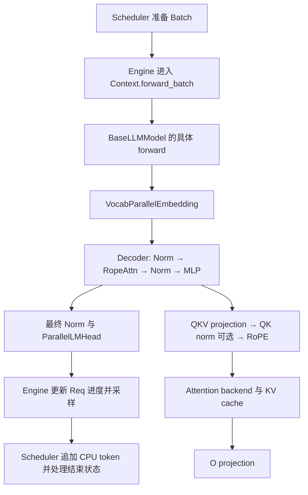

# Mini-SGLang 源码学习：models → layers → core

本文对照本地源码版本 `9a91cfafe754aa85daee49998176275667eb58f2`，阅读日期 2026-09-28。内容针对当前实现；模型加载练习见 [动手任务](exercises/llama-checkin/README.md)。安装方式见 [安装笔记](mini-sglang-notes.md)。

## 2.1 minisgl.models

### BaseLLMModel：统一推理入口

入口：[models/base.py](python/minisgl/models/base.py)、[layers/base.py](python/minisgl/layers/base.py)。

`BaseLLMModel(ABC, BaseOP)` 只规定 `forward(self) -> torch.Tensor`。返回值是 logits；采样在 Engine 中完成。这里的基类不是 `torch.nn.Module`，不能直接套用 PyTorch Module 的参数注册、调用与设备迁移习惯。

`BaseOP` 提供轻量的权重遍历与加载：遍历公开 Tensor 属性及子 BaseOP，跳过以下划线开头的属性。`load_state_dict` 消费传入字典，检查 shape/dtype，再替换 Tensor 属性。`OPList` 专门处理层列表及数字索引前缀。`StateLessOP` 不保存或加载权重；它仍可持有运行时缓冲，例如 RoPE 的 cos/sin cache。

Llama/Qwen 的顶层 `forward()` 不接收 input_ids，而是通过 `get_global_ctx().batch.input_ids` 取得输入。Engine 必须先进入 `ctx.forward_batch(batch)`，模型和底层算子才能共享本轮上下文。

### ModelConfig：把外部配置转换为内部结构

入口：[models/config.py](python/minisgl/models/config.py)。

`ModelConfig` 是 frozen dataclass，`from_hf()` 把 Hugging Face 配置转换成内部统一字段。

| 字段 | 作用 |
| --- | --- |
| `num_layers`、`hidden_size` | Decoder 层数和残差流宽度 |
| `num_qo_heads`、`num_kv_heads`、`head_dim` | Q/O 头数、KV 头数、每头维度；决定 QKV 投影及缓存尺寸 |
| `vocab_size`、`intermediate_size` | 词表大小和 MLP 中间宽度 |
| `rms_norm_eps`、`hidden_act` | 归一化稳定项与门控激活函数 |
| `tie_word_embeddings` | 是否让输出 LM head 使用输入 embedding 权重 |
| `rotary_config` | RoPE 的 head_dim、rotary_dim、max_position、base、scaling |
| `model_type`、`architectures` | 模型类型与架构注册信息 |
| MoE 相关字段 | 专家数、每 token 激活专家数等；本文三个 dense 模型不使用 |

几个值得关注的转换规则：

- KV 头数缺省时回退到 attention 头数；head_dim 缺省或为空时使用 `hidden_size // num_attention_heads`。显式 head_dim 存在时应使用配置值，不能始终假设 `hidden_size == num_qo_heads * head_dim`。
- 支持从外层配置取出 `text_config`，并补入部分缺失属性；此步骤可能修改传入的 HF 配置对象。frozen 并不表示内部字典或原始 HF 配置也不可变。
- `rotary_dim` 当前设为 head_dim；RoPE 实现也要求二者相等。
- `is_moe` 根据 model_type 是否含有 `moe` 判断。

[models/register.py](python/minisgl/models/register.py) 的 `get_model_class()` 名称像是返回类，实际会导入类并实例化，返回模型对象。

### Llama / Qwen2 / Qwen3：骨架一致，注意力配置不同

入口：[llama.py](python/minisgl/models/llama.py)、[qwen2.py](python/minisgl/models/qwen2.py)、[qwen3.py](python/minisgl/models/qwen3.py)。

| 当前实现 | QKV bias | Q/K 逐头 RMSNorm | O projection bias |
| --- | --- | --- | --- |
| Llama | 无 | 无 | 无 |
| Qwen2 | 有 | 无 | 无 |
| Qwen3 | 无 | 有 | 无 |

每种模型均分三层组织：

```text
XxxForCausalLM：从 Context 取 token → XxxModel → ParallelLMHead → logits
XxxModel：Embedding → N 个 DecoderLayer → 最后一次 RMSNormFused
DecoderLayer：RMSNormFused → Attention → RMSNormFused → GatedMLP
```

不要只看三个模型文件：[models/utils.py](python/minisgl/models/utils.py) 才实现共享的 `RopeAttn` 和 `GatedMLP`。

```text
RopeAttn: LinearQKVMerged → AttentionLayer → LinearOProj
GatedMLP: 合并 gate/up 投影 → act(gate) * up → down 投影
```

MLP 支持 silu 和 gelu，由 `hidden_act` 选择。gate/up 合并可用一次线性计算得到两路输出。

### residual 为什么作为额外变量传递？

普通 pre-norm Decoder 的数学结构为：

```text
h1 = h + Attention(Norm1(h))
h2 = h1 + MLP(Norm2(h1))
```

这里将加法推迟到下一次 `RMSNormFused`，与归一化融合：

1. 首层输入 `x=h, residual=None`，第一处 norm 返回 `(Norm(h), h)`。
2. Attention 输出记为 `a`，第二处 norm 更新 `residual = h+a`，并把 x 改写成归一化后的 residual。
3. MLP 输出记为 `m`，本层返回 `(m, h+a)`，此时尚未做最后一次 `+m`。
4. 下一层第一处 norm，或最后的 model.norm，完成 residual 与 m 的相加及归一化。

所以单看 `return x, residual`，不能把 x 当成已经加完所有残差的完整隐藏状态。

## 2.2 minisgl.layers

统一符号：T 为本轮实际执行的 token 数（可能包含图执行 padding），H 为 hidden_size，V 为词表大小，P 为 TP 数量，d 为 head_dim，nq/nkv 为全局 Q/KV 头数。

### VocabParallelEmbedding：按词表行切分

入口：[layers/embedding.py](python/minisgl/layers/embedding.py)。

每个 rank 构造 `ceil(V/P)` 行的本地权重；`vocab_range` 存储 `(起始 token id, 有效行数)`，第二项不是结束下标。输入 `[T]`，输出 `[T,H]`。

TP>1 时，indexing 内核只为本 rank 负责的 token 查询有效 embedding，其他位置贡献零，之后 all-reduce 求和，得到每个 token 的完整向量。按词表切分并没有把 H 维分成 P 份。

`ParallelLMHead` 复用词表并行框架，但执行线性投影 `[R,H] → [R,本地词表宽度]`，再 all-gather 并整理词表维度。Prefill 先根据 attention metadata 选出每个真实请求最后一个 token 的隐藏状态，因此通常不计算所有提示 token 的 logits；decode 可包含 padding 行，Engine 采样前再截取真实 batch.size。共享权重时直接读取 tied_embedding.weight。

### LinearQKVMerged：一次计算本地 Q/K/V

入口：[layers/linear.py](python/minisgl/layers/linear.py)。

本地 Q 头数 `q = nq/P`。KV 头数通常为 `k = nkv/P`；当 P>nkv 且 P 可被 nkv 整除时，每 rank 持有一个 KV 头，并在多个 rank 间复制。不能把 KV 头数简单整除成零。

```text
输入 x:       [T,H]
本地 weight:  [(q+2k)*d,H]
合并输出 qkv: [T,(q+2k)*d]
拆分后 Q:     [T,q*d]
拆分后 K/V:   [T,k*d]
```

例：H=4096、nq=32、nkv=8、d=128、P=4，则本地 q=8、k=2，qkv 宽度为 1536，按 `[1024,256,256]` 拆开。这是演示配置，不代表某个下载模型的实际参数。

[models/weight.py](python/minisgl/models/weight.py) 会先对原始 q_proj/k_proj/v_proj 分片，再按 Q、K、V 顺序拼接权重；不能对已拼接的全局 QKV 随便等分。LinearQKVMerged 本身只调用 F.linear，不在此处汇聚 QKV。Attention 后的 LinearOProj 将本地结果投影回 H，并在多卡时 all-reduce。

### RMSNorm 与 RMSNormFused

入口：[layers/norm.py](python/minisgl/layers/norm.py)。

```text
y = x / sqrt(mean(x², 最后一维) + eps) * weight
```

RMSNorm 不减去均值；本实现没有额外 bias。普通 `forward` 返回结果，`forward_inplace` 覆盖输入。Qwen3 用 `[d]` 权重归一化 `[T,heads,d]` 的最后一维，即每个头内归一化，并在各头之间共享这组权重。Decoder 的 norm 则使用 `[H]` 权重。

`RMSNormFused` 在 residual 存在时，通过 FlashInfer 原地完成 residual 加法和归一化，返回的 x/residual 都要按已更新的值理解。

### RoPE：给 Q/K 注入位置信息

入口：[layers/rotary.py](python/minisgl/layers/rotary.py)。

`RotaryEmbedding` 先生成逆频率、各位置相位与 cos/sin cache。调用时取 `batch.positions` 对 Q/K 原地旋转，不旋转 V，也不会改变张量形状。它不把位置向量加到 embedding 上。

逆频率形式为 `base ** (-2i/d)`，位置 p 对应角度 `p * inv_freq[i]`。成对坐标旋转让 Q/K 点积包含相对位置关系；具体坐标配对布局由调用的 FlashInfer 内核约定实现。

当前源码要求 rotary_dim=head_dim，head_size 在 64/128/256/512 中，支持 default、llama3、yarn 分支。`get_rope` 缓存相同参数的对象；meta 构造模型时需要 `set_rope_device` 指定真正生成缓存的位置。不要把 HF 配置支持某种 scaling 等同于这里已经支持。

### AttentionLayer：连接模型组件与注意力后端

入口：[layers/attention.py](python/minisgl/layers/attention.py)。

`forward(qkv)` 的顺序：

1. 获取当前 Context，按本地头数拆分 Q/K/V。
2. 如提供 q_norm/k_norm，先做逐头 RMSNorm。
3. 使用 batch.positions 对 Q/K 应用 RoPE。
4. Q reshape 为 `[T,q,d]`，调用 `ctx.attn_backend.forward(q,k,v,layer_id,batch)`。
5. 输出展平为 `[T,q*d]`；外层 RopeAttn 再执行 O projection。

AttentionLayer 不负责 QKV 线性投影，也没有直接写出 softmax(QKᵀ)V。后端处理具体 attention 与 KV 读写。例如 [attention/fi.py](python/minisgl/attention/fi.py) 按 batch.out_loc 写入当前层 K/V，再读取历史 paged KV 执行注意力。Qwen3 中 Q/K norm 对象由 RopeAttn 持有；AttentionLayer 作为 StateLessOP 引用它们，避免重复保存权重。

## 2.3 minisgl.core

入口：[core.py](python/minisgl/core.py)。

### Req：单条请求及生成进度

| 字段/属性 | 含义 |
| --- | --- |
| `uid` | 请求标识 |
| `input_ids` | CPU token 历史；后续通过 append_host 追加输出 |
| `table_idx` | 此请求在 token pool/page table 中的行号 |
| `cached_len` | 已有 KV 的前缀长度 |
| `device_len` | 设备侧逻辑序列长度，初始化为 len(input_ids) |
| `output_len` | 初始化时分配的输出长度预算，不是已生成 token 数 |
| `max_device_len` | 初始化输入长度 + output_len |
| `extend_len` | device_len-cached_len，本轮尚需处理的 token 数 |
| `remain_len` | max_device_len-device_len，剩余长度预算 |
| `cache_handle` | 前缀缓存句柄 |
| `sampling_params` | 温度、top-k/top-p、EOS 与长度设置 |

`Req(eq=False)` 不按字段内容生成 dataclass 相等比较。初始化要求 CPU input_ids，并满足 `0 <= cached_len < device_len <= max_device_len`。

普通请求示例：提示词 5 token，已有前缀 KV 为 3，允许输出 2 token。

| 时刻 | cached_len | device_len | extend_len | remain_len |
| --- | --- | --- | --- | --- |
| prefill 前 | 3 | 5 | 2 | 2 |
| 第一次 complete_one 后 | 5 | 6 | 1 | 1 |
| 下一次 decode 的 complete_one 后 | 6 | 7 | 1 | 0 |

`complete_one()` 先把旧 device_len 写到 cached_len，再把 device_len 加一。新生成 token 尚未经过下一轮模型计算，所以它尚无 KV，extend_len 仍为 1。

`append_host()` 只追加 CPU token，不更新上述设备侧计数。Engine 在提交前向计算后更新逻辑进度，GPU→CPU 结果稍后由 Scheduler 消费；不要认为 `len(input_ids)` 随时都等于 device_len，也不要把逻辑状态更新当作 GPU 已完成的同步信号。

`can_decode` 只检查长度预算；EOS、取消等终止条件在其他层处理。分块 prefill 使用 [ChunkedReq](python/minisgl/scheduler/prefill.py)，强制 can_decode=False，中间块不按普通请求返回输出，不能把上表直接套到所有 chunk。

### Batch：本轮执行分组，不是固定 B×S

`Batch(reqs, phase)` 先保存请求列表与 prefill/decode 阶段，其他字段由执行准备过程补齐：

| 字段 | 用途 |
| --- | --- |
| `input_ids` | 拼接的设备 token，形状 `[T]` |
| `positions` | 每个 token 在自己请求中的绝对位置，形状 `[T]` |
| `out_loc` | 每个输入 token 的 KV 写入槽位，形状 `[T]` |
| `padded_reqs` | 为执行形状（如 CUDA Graph）补齐的请求列表 |
| `attn_metadata` | 各请求的长度、页索引等后端元数据 |

真实请求数是 `size=len(reqs)`，执行请求数是 `padded_size=len(padded_reqs)`。这些 init=False 字段不会在构造时自动生成可用张量，必须先准备再访问。

例如两个 prefill 请求 `(cached_len,device_len)` 分别为 `(3,5)` 与 `(0,3)`，没有 padding 时 T=5，positions 为 `[3,4,0,1,2]`。不同请求长度无需对齐成矩形；后端元数据描述各自边界。Decode 通常每请求贡献一个 token。

实际准备链见 [scheduler/scheduler.py](python/minisgl/scheduler/scheduler.py)：graph_runner 补齐请求 → 分配页 → 建 positions 和映射 → 查询 page_table 得 out_loc → 后端准备 metadata → 在 _forward 中从 token_pool 取 input_ids。

### Context：每个进程的推理上下文

Context 保存 page_size、page_table、kv_cache、attention/MoE backend 和活动 batch。page_table 的 token 索引粒度始终按 1 处理，即使系统按多 token 的页分配，也不要把表的列号直接理解为页号。

```python
with ctx.forward_batch(batch):
    logits = model.forward()
```

上下文管理器设置 `_batch`，在 finally 中清空，异常退出也会清理。不允许嵌套 forward_batch；未进入作用域时访问 ctx.batch 会触发断言。`set_global_ctx` 只允许初始化一次。

这里的“全局”是 Python 进程内全局；多卡 TP worker 各有自己的 Context。它并非跨进程共享对象，也不是线程局部或支持并发 batch 的上下文容器。

## 把三部分连起来



阅读时可自查：为什么 Qwen3 的 Q/K norm 权重长度为 d？为什么 KV 头数小于 TP 数量仍能执行？为什么 prefill 的 T 与 batch.size 不同？为什么 Req 结束时最后一个生成 token 可能还没有 KV？为什么模型 forward 不需要显式传入 Batch？答案分别对应逐头归一化、KV 复制、变长 token 拼接、下一轮才计算新 token 的 KV，以及进程内 Context 的活动 batch。
